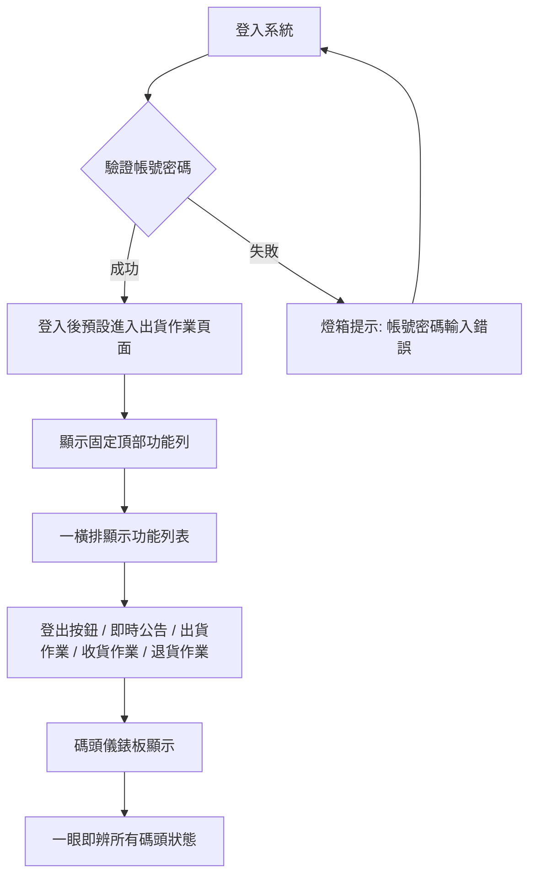
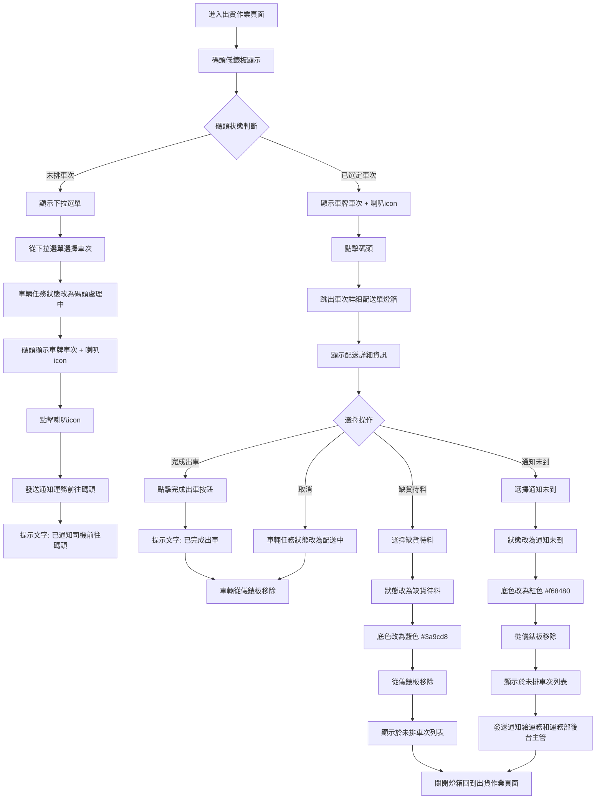
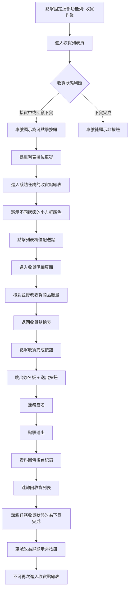
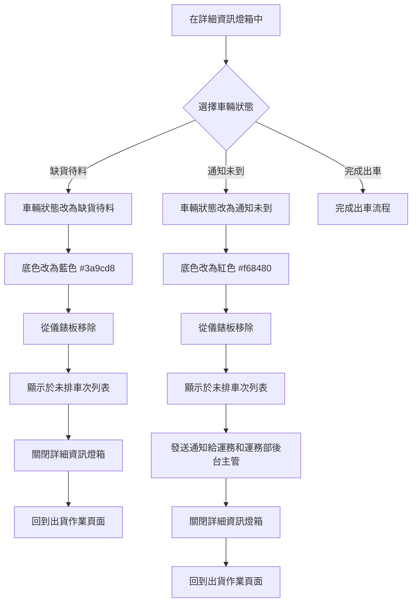
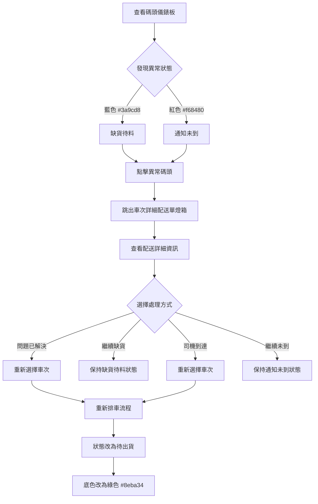

# UX Design Specification - 昶青_碼頭系統

**Author:** Muki
**Date:** 2026-01-27

---

## Executive Summary

### Project Vision

**倉儲管理系統的 UX 願景：**
提供直觀、即時、符合現場作業流程的倉儲管理介面，完全取代 Excel/電話追蹤方式。透過清晰的視覺化狀態、觸控友善的操作與即時同步，讓倉儲人員能「一眼即辨」所有任務狀態，快速處理異常，實現「無縫同步」的協作體驗。

### Target Users

**主要使用者：倉儲人員**
- 技術熟悉度：中等（操作介面清楚標示，教學後可輕易熟悉）
- 主要裝置：平板（需支援桌面與手機）
- 使用情境：現場作業，需要快速查看狀態、核對修改、處理異常
- 核心需求：資訊全面清楚、可輕鬆核對修改、符合現場流程

**次要使用者：**
- 後台管理員：系統管理與監控
- 運務人員：透過運務 APP 協作（接收通知、回報狀態、簽名）

### Key Design Challenges

1. **平板優先的響應式設計**
   - 觸控友善：按鈕至少 44x44px，簽名板觸控操作
   - 碼頭儀錶板在平板上的最佳佈局（多碼頭狀態顯示）
   - 三層架構（列表→總表→明細）的導航清晰度

2. **資訊密度與清晰度平衡**
   - 碼頭儀錶板需同時顯示多個碼頭狀態（顏色編碼：綠色/藍色/紅色）
   - 即時狀態更新的視覺化（< 3 秒同步）
   - 複雜資訊的層次化呈現（收貨作業三層架構）

3. **操作流程符合現場作業**
   - 減少操作步驟，關鍵操作（完成出車、簽名）需明確
   - 異常處理流程直觀（缺貨待料、通知未到）
   - 符合現場作業習慣的流程設計

4. **UI 風格一致性**
   - 與現有客戶 web 即時公告頁面保持一致
   - 沿用現有色彩方案（淺藍色、白色、綠色強調）
   - 保持現有組件樣式（圓角容器、按鈕樣式、控制欄）

### Design Opportunities

1. **顏色編碼的狀態視覺化**
   - 碼頭儀錶板：綠色（待出貨）、藍色（缺貨待料）、紅色（通知未到）
   - 未排車次列表：顏色狀態區分
   - 一眼即辨狀態，減少認知負擔

2. **即時同步的視覺回饋**
   - 狀態變更的動畫效果（顏色更新 < 1 秒）
   - 同步中的視覺提示
   - 多裝置同步的即時反映

3. **觸控友善的互動設計**
   - 簽名板體驗優化（觸控繪製、清除、確認）
   - 燈箱操作的觸控優化（任務資訊顯示、狀態修改）
   - 下拉選單的觸控操作

4. **清晰的資訊架構**
   - 三層架構的清晰導航（收貨列表→配送點總表→收貨明細）
   - 篩選與搜尋的直觀設計（沿用現有模式）
   - 批量操作的明確提示

---

## Core User Experience

### Defining Experience

**核心使用者動作：碼頭儀錶板的狀態查看與操作**

碼頭儀錶板是整個系統的核心互動中心。倉儲人員透過碼頭儀錶板：
- 一眼查看所有碼頭狀態（顏色編碼：綠色/藍色/紅色）
- 快速選擇車次排入碼頭
- 即時處理異常狀態（缺貨待料、通知未到）
- 完成出車作業

**核心體驗循環：**
1. 查看狀態 → 2. 選擇操作 → 3. 確認完成 → 4. 狀態更新 → 回到 1

所有前台功能都是必要且常使用的，設計需確保每個功能都清晰、易用、符合現場作業流程。

### Platform Strategy

**主要平台：Web App（平板優先）**

**平台需求：**
- 主要裝置：平板（觸控操作）
- 支援裝置：桌面（滑鼠/鍵盤）、手機（響應式設計）
- 即時同步：維持即時連線
- 離線功能：網路中斷時可暫存操作，恢復後自動同步
- 斷線處理：網路中斷時明確提示，恢復後自動重連

**平台建議：**
- 使用 SPA（Single Page Application）架構，適合維持即時連線機制
- 實現 Service Worker 支援離線暫存
- 關鍵操作（完成出車、簽名）在離線時暫存，恢復後自動同步
- 提供離線狀態指示器，讓使用者清楚知道連線狀態

### Effortless Interactions

**應該完全自然、無需思考的互動：**

1. **查看碼頭狀態**
   - 顏色編碼：綠色（待出貨）、藍色（缺貨待料）、紅色（通知未到）
   - 一眼即辨，無需閱讀文字

2. **異常狀態的快速處理**
   - 點擊異常碼頭 → 燈箱顯示任務資訊 → 選擇狀態 → 完成
   - 流程直觀，減少思考時間

3. **自動同步機制**
   - 狀態變更自動同步（< 3 秒）
   - 碼頭選項自動排除已選定碼頭
   - 無需手動刷新或確認

4. **減少操作步驟**
   - 減少電話確認（資訊都在系統中）
   - 簡化操作流程（關鍵操作明確）
   - 批量操作支援（全部已讀、全部刪除）

### Critical Success Moments

**使用者意識到「這個更好」的時刻：**
- 開啟系統立即看到所有狀態（不需要翻 Excel、打電話）
- 不需要打電話就能知道狀況（資訊即時同步）

**使用者感到成功或完成的時刻：**
- 完成所有出車任務（當天所有有送貨但未出車的車輛都已處理）
- 完成收貨並請運務簽名（收貨狀態變為下貨完成）

**如果失敗會破壞體驗的互動：**
- 狀態不同步（看到錯誤資訊）
- 操作失敗沒有提示（不知道是否成功）

**成敗攸關的使用者流程：**
- 出貨作業流程：選擇車次 → 通知司機 → 完成出車
- 收貨作業流程：列表 → 總表 → 明細 → 簽名

**首次使用者的成功時刻：**
- 第一次成功完成排車（選擇車次、通知司機、完成出車）

### Experience Principles

基於以上討論，以下是核心體驗原則：

1. **一眼即辨原則**
   - 狀態視覺化優先（顏色編碼）
   - 關鍵資訊突出顯示
   - 減少認知負擔

2. **無縫同步原則**
   - 狀態自動同步，無需手動刷新
   - 即時視覺回饋（< 1 秒顏色更新）
   - 離線暫存，恢復後自動同步

3. **流程符合現場原則**
   - 操作步驟符合現場作業習慣
   - 關鍵操作明確（完成出車、簽名）
   - 異常處理直觀（缺貨待料、通知未到）

4. **觸控友善原則**
   - 按鈕至少 44x44px
   - 簽名板觸控操作優化
   - 燈箱操作觸控友善

5. **資訊全面清楚原則**
   - 三層架構清晰導航（列表→總表→明細）
   - 資訊完整呈現，可輕鬆核對修改
   - 篩選與搜尋直觀設計

---

## Desired Emotional Response

### Primary Emotional Goals

**核心情感目標：掌控感、效率感、信心**

使用者使用倉儲管理系統時應該感受到：
- **掌控感：** 清楚掌握所有碼頭狀態、任務進度、異常情況
- **效率感：** 快速完成任務，減少等待與確認時間
- **信心：** 資訊準確可靠，操作結果可預期

**推薦給同事的情感：**
- 掌控感、效率感、信心都具備，讓使用者願意推薦給同事

**完成主要目標後的情感：**
- **安心感：** 所有任務狀態清楚，無需擔心遺漏或錯誤

**與競爭方案（Excel/電話）區分的情感：**
- **專業感：** 系統化管理，資訊完整準確
- **現代感：** 即時同步、視覺化狀態、觸控操作

### Emotional Journey Mapping

**首次發現產品：**
- **興奮：** 可以簡化工作流程，取代 Excel/電話追蹤

**核心體驗/操作時：**
- **專注、流暢：** 操作直觀，流程順暢，無需過多思考

**完成任務後：**
- **安心：** 任務完成，狀態清楚，無需擔心遺漏

**出錯時：**
- **不焦慮：** 清楚知道問題所在、如何處理，有明確的錯誤提示與恢復機制

**再次使用時：**
- **熟悉：** 介面清晰，操作習慣
- **信任：** 系統可靠，資訊準確
- **穩定：** 狀態同步，操作可預期

### Micro-Emotions

**關鍵微情感：**
- **穩定：** 系統穩定可靠，狀態同步準確
- **效率：** 操作高效，減少等待時間

這些微情感支持主要情感目標（掌控感、效率感、信心），並避免負面情感（焦慮、困惑、挫折）。

### Design Implications

**情感-設計連接：**

1. **掌控感 → UX 設計方法**
   - 即時同步：狀態變更自動同步（< 3 秒），無需手動刷新
   - 異常通知：異常狀態視覺化（顏色編碼），即時提示
   - 資訊全面：所有關鍵資訊清晰呈現，可輕鬆核對修改

2. **效率感 → UX 設計方法**
   - 減少操作步驟：關鍵操作明確，流程簡化
   - 快速視覺回饋：狀態變更動畫（< 1 秒），操作即時反映
   - 批量操作支援：全部已讀、全部刪除等批量功能

3. **信心 → UX 設計方法**
   - 資訊準確性：資料同步準確率 100%，狀態真實反映
   - 操作可靠性：操作成功/失敗明確提示，錯誤處理完善
   - 視覺一致性：UI 風格一致，操作模式可預期

4. **避免負面情感 → UX 設計方法**
   - 狀態不同步：即時同步機制，多裝置同步支援
   - 操作失敗無提示：明確的成功/失敗提示，錯誤訊息清楚
   - 困惑：介面標示清楚，操作流程直觀

5. **愉悅時刻 → UX 設計方法**
   - 完成任務的通知：完成出車、完成收貨時的視覺回饋
   - 狀態變更動畫：顏色更新動畫效果
   - 成功操作的確認：操作成功的明確提示

### Emotional Design Principles

基於以上討論，以下是情感設計原則：

1. **掌控感優先原則**
   - 即時同步與異常通知確保使用者始終掌握最新狀態
   - 資訊全面呈現，減少不確定性
   - 視覺化狀態（顏色編碼）讓狀態一目了然

2. **效率感提升原則**
   - 減少操作步驟，關鍵操作明確
   - 快速視覺回饋，操作即時反映
   - 批量操作支援，提升處理效率

3. **信心建立原則**
   - 資訊準確性：資料同步準確，狀態真實反映
   - 操作可靠性：明確的成功/失敗提示，錯誤處理完善
   - 視覺一致性：UI 風格一致，操作模式可預期

4. **穩定感營造原則**
   - 系統穩定可靠，狀態同步準確
   - 操作可預期，結果一致
   - 錯誤處理完善，恢復機制明確

5. **安心感創造原則**
   - 完成任務後的明確確認
   - 所有狀態清楚呈現，無需擔心遺漏
   - 異常處理直觀，問題可快速解決

---

## UX Pattern Analysis & Inspiration

### Inspiring Products Analysis

**Line（通訊應用）**

**核心優勢：**
- 操作流程簡易：功能直觀，學習成本低
- 視覺設計清楚：資訊層次明確，易於理解
- 功能設計本身：功能實用，符合使用者需求
- 穩定、效率、易用性：系統穩定，操作高效，易於使用

**可學習的 UX 模式：**
- 簡潔的操作流程：減少步驟，關鍵操作明確
- 清晰的視覺層次：重要資訊突出，次要資訊適當隱藏
- 實用的功能設計：功能符合實際需求，不追求過度設計
- 穩定的系統體驗：操作可預期，錯誤處理完善

**現有客戶 Web 即時公告頁面**

**核心優勢：**
- 清晰的資訊架構：搜尋、篩選、列表層次分明
- 一致的視覺風格：淺藍色、白色、綠色強調色
- 直觀的操作流程：批量操作、狀態管理
- 實用的功能設計：訊息保留提示、全選功能

**可學習的 UX 模式：**
- 搜尋與篩選模式：關鍵字搜尋、日期範圍、下拉選單
- 批量操作模式：全選、全部已讀、全部刪除
- 資訊提示模式：訊息保留天數提示
- 一致的組件樣式：圓角容器、按鈕樣式、控制欄

### Transferable UX Patterns

**導航模式：**

1. **固定頂部功能列**
   - 適用於：主要功能模組切換（出貨、收貨、退貨、公告）
   - 設計要求：
     - 登入後頁面最上方固定顯示功能列
     - 包含：登出按鈕、即時公告（小鈴鐺 icon）、出貨作業、收貨作業、退貨作業
     - 登入後預設進入出貨作業頁面
     - 點擊跳轉所選頁面
   - 參考：現有系統的頂部導航欄、Line 的簡潔導航

2. **三層架構導航（列表→總表→明細）**
   - 適用於：收貨作業管理
   - 參考：現有系統的資訊層次化呈現

**互動模式：**

1. **顏色編碼狀態視覺化**
   - 適用於：碼頭儀錶板、未排車次列表
   - 參考：Line 的狀態指示、現有系統的視覺化設計
   - 實現：綠色（待出貨）、藍色（缺貨待料）、紅色（通知未到）

2. **燈箱/彈窗模式**
   - 適用於：任務資訊顯示、狀態修改
   - 參考：Line 的彈窗設計、現有系統的燈箱功能
   - 實現：觸控友善，操作明確

3. **即時狀態更新**
   - 適用於：狀態變更同步、多裝置同步
   - 參考：Line 的即時訊息同步
   - 實現：狀態變更動畫（< 1 秒），同步提示

**視覺模式：**

1. **清晰的視覺層次**
   - 適用於：所有頁面設計
   - 參考：Line 的資訊層次、現有系統的視覺架構
   - 實現：重要資訊突出，次要資訊適當隱藏

2. **一致的組件樣式**
   - 適用於：按鈕、輸入框、下拉選單
   - 參考：現有系統的組件樣式
   - 實現：圓角容器、藍色按鈕（主要操作）、白色按鈕（次要操作）

3. **觸控友善的設計**
   - 適用於：平板操作
   - 參考：Line 的觸控操作
   - 實現：按鈕至少 44x44px，觸控區域足夠大

### Anti-Patterns to Avoid

**要避免的 UX 反模式：**

1. **過度複雜的操作流程**
   - 問題：增加學習成本，降低效率
   - 避免方法：簡化操作步驟，關鍵操作明確（參考 Line 的簡潔流程）

2. **視覺層次不清**
   - 問題：使用者難以找到關鍵資訊
   - 避免方法：清晰的視覺層次，重要資訊突出（參考 Line 的視覺設計）

3. **功能過度設計**
   - 問題：功能複雜但不實用
   - 避免方法：功能設計符合實際需求（參考 Line 的功能設計）

4. **狀態不同步**
   - 問題：使用者看到錯誤資訊，失去信任
   - 避免方法：即時同步機制，多裝置同步支援

5. **操作失敗無提示**
   - 問題：使用者不知道操作是否成功
   - 避免方法：明確的成功/失敗提示，錯誤訊息清楚

6. **觸控區域太小**
   - 問題：平板操作困難，容易誤觸
   - 避免方法：按鈕至少 44x44px，觸控區域足夠大

### Design Inspiration Strategy

**採用：**

1. **Line 的簡潔操作流程**
   - 原因：支持效率感提升原則，符合使用者需求（操作流程簡易）
   - 應用：簡化關鍵操作流程（完成出車、簽名），減少步驟

2. **Line 的清晰視覺設計**
   - 原因：支持一眼即辨原則，符合使用者需求（視覺設計清楚）
   - 應用：清晰的視覺層次，重要資訊突出，顏色編碼狀態

3. **現有系統的搜尋與篩選模式**
   - 原因：保持 UI 風格一致性，符合使用者習慣
   - 應用：沿用現有的搜尋、篩選、批量操作模式

4. **現有系統的組件樣式**
   - 原因：保持 UI 風格一致性
   - 應用：沿用圓角容器、按鈕樣式、控制欄設計

5. **固定頂部功能列導航**
   - 原因：符合使用者需求，提供清晰的功能切換
   - 應用：登入後固定顯示功能列，包含登出、即時公告（小鈴鐺 icon）、出貨、收貨、退貨作業，預設進入出貨作業頁面

**調整：**

1. **Line 的即時同步模式**
   - 調整：針對倉儲管理系統的狀態同步需求
   - 應用：即時同步，狀態變更動畫（< 1 秒）

2. **現有系統的列表模式**
   - 調整：針對碼頭儀錶板的多碼頭狀態顯示
   - 應用：顏色編碼狀態，觸控友善的碼頭卡片設計

**避免：**

1. **過度複雜的功能設計**
   - 原因：不符合使用者需求（功能設計本身），會增加學習成本
   - 避免：功能設計符合實際需求，不追求過度設計

2. **視覺層次不清**
   - 原因：不符合使用者需求（視覺設計清楚），會降低效率
   - 避免：清晰的視覺層次，重要資訊突出

3. **狀態不同步**
   - 原因：不符合使用者需求（穩定、效率），會失去信任
   - 避免：即時同步機制，多裝置同步支援

---

## Design System Foundation

### Design System Choice

**選擇：Element Plus（Vue.js 設計系統）**

Element Plus 是專為 Vue.js 3 設計的企業級 UI 組件庫，提供豐富的組件和完整的設計系統基礎。

### Rationale for Selection

**選擇理由：**

1. **Vue.js 原生支援**
   - 專為 Vue.js 3 設計，與 Vue 生態系統完美整合
   - 組件 API 符合 Vue 3 Composition API 風格
   - 與 Vue Router、Vuex/Pinia 整合順暢

2. **快速開發**
   - 豐富的組件庫（60+ 組件），涵蓋大部分 UI 需求
   - 完善的文檔和範例，學習成本低
   - 適合內部工具快速開發需求

3. **可主題化**
   - 支援 CSS 變數主題定制
   - 可調整顏色、字體、組件樣式
   - 可完全符合現有 UI 風格（淺藍色、白色、綠色強調）

4. **觸控友善**
   - 組件支援觸控操作
   - 響應式設計支援平板與手機
   - 符合平板優先需求

5. **無障礙性支援**
   - 內建 ARIA 標籤
   - 鍵盤導航支援
   - 符合 WCAG AA 等級要求

6. **文檔與社群**
   - 完善的中文文檔
   - 活躍的社群支援
   - 適合中文團隊使用

### Implementation Approach

**實作方式：**

1. **基礎安裝與配置**
   - 安裝 Element Plus 套件
   - 配置 Vue 3 專案整合
   - 設定主題定制系統

2. **主題定制**
   - 使用 CSS 變數系統定制色彩方案
   - 調整組件樣式（圓角、按鈕、控制欄等）
   - 符合現有 UI 風格

3. **自訂組件開發**
   - 基於 Element Plus 組件擴展自訂組件
   - 開發碼頭儀錶板、簽名板等特殊組件
   - 保持與 Element Plus 設計語言一致

### Customization Strategy

**定制策略：**

1. **色彩方案定制**
   - 主色：淺藍色（符合現有 UI 風格）
   - 強調色：綠色（符合現有 UI 風格）
   - 背景色：白色
   - 透過 Element Plus 的 CSS 變數系統定制

2. **組件樣式定制**
   - 圓角容器：調整 border-radius 符合現有風格
   - 按鈕樣式：藍色按鈕（主要操作）、白色按鈕（次要操作）
   - 控制欄：淺藍色橫條樣式
   - 透過 SCSS 變數或 CSS 覆蓋定制

3. **自訂組件擴展**
   - 碼頭儀錶板：基於 Element Plus 的 Card 組件擴展
   - 簽名板：自訂組件，整合觸控繪製功能
   - 燈箱：基於 Element Plus 的 Dialog 組件定制
   - 固定頂部功能列：基於 Element Plus 的 Menu 組件定制

4. **響應式設計**
   - 使用 Element Plus 的響應式工具類
   - 平板優先的佈局設計
   - 觸控友善的互動設計（按鈕至少 44x44px）

---

## 2. Core User Experience

### 2.1 Defining Experience

**定義性體驗：碼頭儀錶板的狀態查看與操作**

碼頭儀錶板是整個系統的定義性體驗。如果這個體驗做得好，其他功能都會更順暢。

**核心動作描述：**
- 「一眼看到所有碼頭狀態，快速選擇車次排入碼頭」
- 「顏色編碼讓狀態一目了然，異常狀態快速處理」

**若只做好一件事，那就是：**
- 碼頭儀錶板的狀態查看與操作體驗

### 2.2 User Mental Model

**使用者目前如何解決這個問題：**
- Excel 表格追蹤：需要翻找、容易出錯、無法即時更新
- 電話確認：需要等待、資訊可能誤解、無法記錄

**使用者帶來的心理模型：**
- 期望：像看儀錶板一樣，一眼看到所有狀態
- 期望：像操作實體碼頭一樣，選擇車次、排入碼頭
- 期望：顏色編碼（綠色=待出貨、藍色=缺貨待料、紅色=通知未到）

**可能困惑或挫折的地方：**
- 狀態不同步（看到錯誤資訊）
- 操作步驟不清楚（不知道下一步）
- 異常處理流程不明確（不知道如何處理缺貨待料）

**現有解決方案的優缺點：**
- Excel：資訊分散、容易出錯、無法即時更新
- 電話：需要等待、資訊可能誤解、無法記錄

### 2.3 Success Criteria

**核心體驗成功標準：**

1. **「這就對了」的時刻：**
   - 開啟系統立即看到所有碼頭狀態（不需要翻 Excel、打電話）
   - 顏色編碼讓狀態一目了然（綠色/藍色/紅色）

2. **使用者感到聰明或完成：**
   - 快速完成排車（選擇車次、通知司機、完成出車）
   - 快速處理異常（缺貨待料、通知未到）

3. **正確操作的回饋：**
   - 狀態變更即時反映（< 1 秒顏色更新）
   - 操作成功明確提示

4. **速度感：**
   - 狀態查看：< 1 秒（一眼即辨）
   - 操作完成：< 3 秒（狀態同步）

5. **自動發生：**
   - 狀態自動同步（無需手動刷新）
   - 碼頭選項自動排除已選定碼頭

### 2.4 Novel UX Patterns

**模式分析：**

**使用已建立的 UX 模式：**
- 儀錶板模式（Dashboard Pattern）：多個狀態卡片顯示
- 顏色編碼模式（Color Coding）：狀態視覺化
- 下拉選單模式（Dropdown）：選擇車次
- 燈箱/彈窗模式（Modal/Dialog）：顯示任務資訊

**創新的組合方式：**
- 即時同步的儀錶板（即時更新）
- 顏色編碼的狀態視覺化（綠色/藍色/紅色）
- 觸控友善的碼頭卡片（平板操作）

**不需要新穎的互動：**
- 使用熟悉的儀錶板模式
- 使用熟悉的顏色編碼
- 使用熟悉的下拉選單和燈箱

### 2.5 Experience Mechanics

**核心體驗機制：碼頭儀錶板的狀態查看與操作**

**1. 啟動（Initiation）：**
- 使用者登入後，預設進入出貨作業頁面
- 立即看到碼頭儀錶板，顯示所有碼頭狀態
- 顏色編碼讓狀態一目了然（綠色/藍色/紅色）

**2. 互動（Interaction）：**
- 查看狀態：一眼看到所有碼頭狀態（顏色編碼）
- 選擇車次：點擊未排車次的碼頭，從下拉選單選擇車次
- 通知司機：點擊「通知司機」按鈕，通知發送至運務 APP
- 修改狀態：點擊碼頭跳出燈箱，查看任務資訊，選擇狀態（完成出車/取消/缺貨待料/通知未到）
- 系統回應：狀態變更即時反映（< 1 秒顏色更新），自動同步（< 3 秒）

**3. 回饋（Feedback）：**
- 視覺回饋：顏色編碼即時更新（< 1 秒）
- 操作回饋：操作成功/失敗明確提示
- 同步回饋：同步中的視覺提示

**4. 完成（Completion）：**
- 完成出車：車輛從碼頭儀錶板移除，狀態更新
- 異常處理：缺貨待料/通知未到的車輛回到未排車次列表
- 下一步：繼續處理其他碼頭的車次

---

## Visual Design Foundation

### Color System

**基於現有 UI 風格：**

**主色調：**
- 主色：淺藍色（用於主要操作、導航、控制欄、頁面標題）
- 強調色：綠色（用於 Logo、成功狀態、強調元素）
- 背景色：白色（主要背景）
- Footer 背景：深藍色（符合現有 UI 風格）

**語義色彩映射：**
- 成功/待出貨：綠色（#8eba34）- 碼頭待出貨狀態、成功操作
- 警告/缺貨待料：藍色（#3a9cd8）- 碼頭缺貨待料狀態
- 錯誤/通知未到：紅色（#f68480）- 碼頭通知未到狀態、錯誤提示
- 主要操作：藍色按鈕（背景藍色、文字白色）
- 次要操作：白色按鈕（背景白色、文字藍色）

**無障礙性考量：**
- 顏色對比：符合 WCAG AA 標準（4.5:1）
- 不依賴顏色傳達資訊：同時使用文字或圖標
- 顏色編碼狀態：綠色（#8eba34 - 待出貨）、藍色（#3a9cd8 - 缺貨待料）、紅色（#f68480 - 通知未到）

### Typography System

**字體策略：**

**整體調性：**
- 清晰、專業、現代

**字體選擇：**
- 參考提供畫面字體（現有客戶 web 即時公告頁面）
- 使用系統字體或 Element Plus 預設字體
- 確保字體清晰易讀

**文字顯示規則：**
- 限制顯示文字寬度，超過自動拆行顯示
- 確保文字清晰易讀，避免過長單行文字

**字體大小層級：**
- H1（頁面標題）：較大字體，淺藍色
- H2（區塊標題）：中等字體
- H3（子標題）：較小字體
- Body（正文）：基礎字體大小，確保清晰易讀
- Small（輔助文字）：較小字體，用於提示、標籤等

**行高與間距：**
- 適當的行高以提升可讀性
- 文字與元素之間有足夠間距

### Spacing & Layout Foundation

**整體佈局：**
- 適中清晰易讀
- 資訊密度適中，符合現場作業需求

**間距單位：**
- 基礎單位：8px（符合 Element Plus 預設）
- 間距系統：4px、8px、12px、16px、24px、32px
- 確保觸控友善的間距（按鈕之間至少 8px）

**元素間距：**
- 清晰易讀為主
- 足夠的間距以提升可讀性
- 重要元素之間有明顯間距區分

**網格系統：**
- 使用 Element Plus 的響應式網格系統（24 欄網格）
- 平板優先的佈局設計
- 響應式斷點：
  - Mobile: < 768px
  - Tablet: 768px - 1024px
  - Desktop: > 1024px

**佈局原則：**
- 固定頂部功能列：頁面最上方固定顯示
- 內容區域：清晰分區，重要資訊突出
- 觸控友善：按鈕與互動元素之間有足夠間距

### Accessibility Considerations

**基本無障礙性（WCAG AA 等級）：**

1. **顏色對比：**
   - 文字與背景對比：至少 4.5:1
   - 大文字（18pt+）對比：至少 3:1

2. **文字可讀性：**
   - 字體大小：確保清晰易讀
   - 行高：適當的行高以提升可讀性
   - 文字寬度：限制顯示文字寬度，超過自動拆行顯示

3. **觸控目標：**
   - 按鈕至少 44x44px
   - 互動元素之間有足夠間距

4. **鍵盤導航：**
   - 所有功能可透過鍵盤操作
   - 清楚的焦點指示

5. **螢幕閱讀器支援：**
   - 適當的 ARIA 標籤
   - 語義化 HTML 結構

---

## Design Direction Decision

### Design Directions Explored

基於現有 UI 風格，我們探索了三個微調變化：

**方向 1：完全遵循現有風格（基準）**
- 完全保持現有 UI 風格，確保與現有系統的一致性
- 傳統圓角設計（8px）、標準陰影效果、標準間距系統
- 清晰的邊框與分隔線，實心藍色按鈕
- 適用於：需要與現有系統完全一致、使用者已熟悉現有風格、快速上線

**方向 2：現代化微調**
- 在現有風格基礎上，加入現代化視覺元素
- 更柔和的圓角（12px）、漸層效果與柔和陰影、流暢的過渡動畫
- 按鈕樣式：漸層背景、陰影效果、hover 動畫
- 適用於：希望視覺更現代、更精緻、需要更好的互動回饋

**方向 3：簡潔微調**
- 更扁平、更清晰的視覺層次
- 更扁平的設計（最小陰影）、清晰的層次結構、簡潔的邊框
- 更大的觸控區域、實心背景按鈕、清晰邊界
- 適用於：需要更清晰的資訊層次、減少視覺干擾、更快的效能

### Chosen Direction

**方向 1：完全遵循現有風格（基準）**

選擇此方向的原因：
- 需要與現有客戶 web 即時公告頁面保持完全一致的 UI 風格
- 確保使用者已熟悉現有風格，減少學習成本
- 快速上線，符合專案時程需求
- 保持系統整體視覺一致性

### Design Rationale

**視覺風格：**
- 傳統圓角設計（8px border-radius），符合現有 UI 風格
- 標準陰影效果（輕微陰影），保持視覺層次
- 標準間距系統（8px 基礎單位），符合 Element Plus 預設
- 清晰的邊框與分隔線，確保資訊層次清晰

**色彩應用：**
- 主色：淺藍色（#4A90E2），用於主要操作、導航、控制欄、頁面標題
- 強調色：綠色（#52C41A），用於 Logo、成功狀態、強調元素
- 背景色：白色，主要背景
- 狀態顯示：**純實色背景顯示狀態，不顯示文字狀態**
  - 綠色實色（#8eba34）：碼頭待出貨狀態
  - 藍色實色（#3a9cd8）：碼頭缺貨待料狀態
  - 紅色實色（#f68480）：碼頭通知未到狀態
- 按鈕樣式：實心藍色背景（#4A90E2）、白色文字

**狀態視覺化原則：**
- **顏色編碼優先：** 狀態完全透過實色背景顯示，不依賴文字說明
- **一眼即辨：** 透過顏色即可立即識別狀態，減少認知負擔
- **無障礙性考量：** 雖然不顯示文字，但透過 ARIA 標籤和語義化 HTML 確保螢幕閱讀器可讀性

**組件樣式：**
- 圓角容器：8px border-radius
- 按鈕：實心藍色背景、白色文字、標準圓角
- 控制欄：淺藍色橫條樣式
- 固定頂部功能列：淺藍色背景、白色文字

### Implementation Approach

> 設計系統的具體實作方案（色彩變數、組件樣式、響應式斷點、無障礙性實作）詳見 [Design System Foundation](#design-system-foundation) 區段。
>
> **狀態顏色快速參考：**
> - 待出貨：綠色（#8eba34）
> - 缺貨待料：藍色（#3a9cd8）
> - 通知未到：紅色（#f68480）

---

## User Journey Flows

### 旅程 1：倉儲人員 - 日常作業成功路徑

**角色：** 倉儲人員（主要使用者）  
**情境：** 典型工作日的完整作業流程

#### 登入與總覽流程

**固定頂部功能列設計：**
- 一橫排顯示，參考客戶前台截圖最上方一橫排的功能列表
- 包含：登出按鈕、即時公告（小鈴鐺 icon）、出貨作業、收貨作業、退貨作業
- 登入後預設進入出貨作業頁面
- 點擊功能項目跳轉所選頁面

#### 出貨作業流程

**碼頭儀錶板互動設計：**
- 碼頭固定顯示後台設定的碼頭名稱
- 未選定車次的碼頭：顯示下拉選單供選擇車次
- 已選定車次的碼頭：顯示車牌（車次）與喇叭 icon
- 點擊喇叭 icon：發送通知運務前往碼頭出貨
- 點擊碼頭：跳出車次詳細配送單燈箱顯示配送詳細資訊
- 當碼頭未排車次皆顯示下拉選單

**未排車次列表：**
- **篩選欄位：** 出貨日期（日期選單）、班別（下拉選單／早班、午班、晚班）
- **不顯示條件：** 不顯示任務狀態為「碼頭處理中」、「配送中」、「配送異常」、「配送完成」的車輛
- **顯示格式：** [車牌]([車次])([任務單號])
- **顏色狀態（依車輛任務狀態區分）：** 綠色＝待出貨、藍色＝缺貨待料、紅色＝通知未到

**狀態顯示：**
- 待出貨狀態：綠色實色背景（#8eba34）
- 缺貨待料：藍色實色背景（#3a9cd8）
- 通知未到：紅色實色背景（#f68480）

#### 收貨作業流程

**收貨作業三層架構：**
1. **收貨列表頁：** 顯示所有收貨任務，排序規則為先依狀態（先回廠下貨再接貨中）、同狀態依回報時間由新到舊；狀態為「接貨中」或「回廠下貨」的車號可點擊
2. **收貨點總表：** 顯示該趟任務的所有配送點，依收貨類型（入庫分貨／越庫作業）與客戶、配送點分類，不同狀態以小方框不同顏色顯示
3. **收貨明細頁面：** 顯示配送點詳細資訊，可核對並修改收貨商品數量

**狀態顏色顯示：**
- 不同狀態可以小方框不同顏色顯示（使用狀態顏色系統）

#### 異常處理流程

**異常處理設計原則：**
- 依現場出貨狀況選擇按鈕（在詳細資訊燈箱中）
- 不須特別跳異常燈箱處理狀態
- 狀態變更即時反映，車輛從儀錶板移除並顯示於未排車次列表

### 旅程 2：倉儲人員 - 異常處理路徑

**角色：** 倉儲人員  
**情境：** 處理缺貨待料與通知未到等異常情況

#### 異常發現與處理流程

**異常處理特點：**
- 異常狀態透過顏色即時反映（藍色：缺貨待料，紅色：通知未到）
- 點擊異常碼頭查看詳細資訊
- 在詳細資訊燈箱中選擇處理方式
- 狀態變更即時同步，車輛從儀錶板移除並顯示於未排車次列表

### Journey Patterns

#### 導航模式

**固定頂部功能列導航：**
- 一橫排顯示，參考客戶前台截圖
- 包含：登出按鈕、即時公告（小鈴鐺 icon）、出貨作業、收貨作業、退貨作業
- 登入後預設進入出貨作業頁面
- 點擊功能項目跳轉所選頁面

**三層架構導航（收貨作業）：**
- 收貨列表 → 收貨點總表 → 收貨明細
- 透過點擊列表欄位（車號、配送點）進入下一層
- 狀態為「下貨完成」的任務不可再次進入收貨點總表

#### 互動模式

**碼頭儀錶板互動：**
- 未排車次：顯示下拉選單
- 已選定車次：顯示車牌（車次）與喇叭 icon
- 點擊喇叭 icon：發送通知
- 點擊碼頭：顯示詳細資訊燈箱

**狀態視覺化：**
- 純實色背景顯示狀態，不顯示文字狀態
- 綠色（#8eba34）：待出貨
- 藍色（#3a9cd8）：缺貨待料
- 紅色（#f68480）：通知未到

**燈箱模式：**
- 車次詳細配送單燈箱：顯示配送詳細資訊
- 簽名板燈箱：運務簽名確認
- 操作確認提示：完成操作後顯示提示文字

#### 回饋模式

**操作回饋：**
- 通知司機：提示文字「已通知司機前往碼頭」
- 完成出車：提示文字「已完成出車」
- 狀態變更：即時反映顏色變化（< 1 秒）
- 同步回饋：狀態變更自動同步（< 3 秒）

**視覺回饋：**
- 狀態顏色即時更新
- 車輛從儀錶板移除動畫
- 列表狀態更新

### Flow Optimization Principles

> 核心設計原則（一眼即辨、無縫同步、流程符合現場、觸控友善等）詳見 [Experience Principles](#experience-principles) 區段。
>
> **流程優化重點：**
> - 減少點擊次數：關鍵操作 ≤ 3 步完成
> - 即時回饋：所有操作提供視覺回饋（< 500ms）
> - 錯誤預防：操作前驗證，減少錯誤發生

---

## Component Strategy

### Design System Components

**Element Plus 提供的基礎組件：**

**表單組件：**
- Button：所有按鈕操作（主要操作、次要操作）
- Input、Select：表單輸入與下拉選單
- DatePicker：日期選擇
- Form：表單驗證與提交

**資料展示：**
- Table：列表顯示（收貨列表、退貨單列表）
- Card：容器與卡片（碼頭儀錶板基礎）
- Tag、Badge：標籤與徽章（狀態標示）

**反饋組件：**
- Dialog：燈箱基礎（車次詳細配送單燈箱）
- Message、Notification：提示訊息
- Loading：載入狀態

**導航組件：**
- Menu：導航基礎（固定頂部功能列）
- Breadcrumb：麵包屑導航
- Tabs：標籤頁

**佈局組件：**
- Row、Col：響應式網格系統
- Container：容器佈局
- Divider：分隔線

**其他：**
- Dropdown：下拉選單
- Popover：彈出框
- Tooltip：提示工具

### Custom Components

#### 1. 碼頭儀錶板（Dock Dashboard）

**Purpose：** 顯示所有碼頭狀態，支援選擇車次、發送通知、查看詳細資訊

**Usage：** 出貨作業頁面的核心互動中心，一橫排顯示所有碼頭

**碼頭顯示規則：**
- 碼頭來源：抓【碼頭管理 > 碼頭列表】依照【碼頭管理 > 碼頭人員列表】該登入者所屬廠區顯示啟用中的碼頭名稱
- 所屬廠區相同的人員使用相同碼頭儀錶板
- 碼頭儀錶板底色固定顯示為綠色

**Anatomy：**
- 碼頭名稱（後台設定，固定顯示）
- 狀態背景（純實色，隨車輛狀態變化；碼頭儀錶板底色固定為綠色）
- 車牌（車次）顯示（選擇車次後顯示，格式：[車牌]([車次])([任務單號])）
- 喇叭 icon（選擇車次後顯示，功能相同）
- 下拉選單（未選擇車次時顯示，選項格式：[車牌]([車次])([任務單號])）

**States：**
- **未排車次：** 預設綠色背景（#8eba34），顯示下拉選單
- **待出貨（已選定）：** 綠色實色背景（#8eba34），顯示車牌（車次）與喇叭 icon
- **缺貨待料：** 藍色實色背景（#3a9cd8），顯示車牌（車次）與喇叭 icon
- **通知未到：** 紅色實色背景（#f68480），顯示車牌（車次）與喇叭 icon
- **清空後：** 回復預設綠色背景（#8eba34），顯示下拉選單

**重要設計原則：**
- **不論車輛狀態，只要選擇進入碼頭皆須顯示車牌與喇叭 icon**
- **功能皆相同：** 點擊喇叭 icon 發送通知，點擊碼頭查看詳細資訊
- **唯碼頭底色隨車輛狀態變化：** 待出貨（綠色）、缺貨待料（藍色）、通知未到（紅色）
- **清空後有下拉選單可再次選擇且底色回復預設綠色**

**Variants：**
- 響應式佈局：平板一橫排顯示，桌面可多列顯示
- 碼頭數量：依後台設定動態顯示

**Accessibility：**
- ARIA label：`aria-label="碼頭 {名稱} - {狀態}"`
- 鍵盤導航：Tab 鍵切換碼頭，Enter 鍵觸發操作
- 焦點指示：清楚顯示當前焦點碼頭

**Content Guidelines：**
- 碼頭名稱清晰顯示（後台設定）
- 狀態透過顏色即時識別
- 車次資訊簡潔顯示（車牌）

**Interaction Behavior：**
- **未排車次：** 點擊下拉選單選擇車次（格式：[車牌]([車次])([任務單號])）→ 該車輛任務狀態改為「碼頭處理中」，顯示車牌與喇叭 icon，底色維持綠色
- **已選定車次：** 點擊喇叭 icon → 發送通知，顯示提示文字「已通知司機前往碼頭」
- **已選定車次：** 點擊碼頭 → 跳出車次詳細配送單燈箱
- **車輛離開碼頭後：** 在燈箱中點擊「完成出車」或「取消」後車輛從碼頭移除，碼頭回復未排車次狀態，顯示下拉選單，底色回復預設綠色

#### 2. 簽名板（Signature Pad）

**Purpose：** 運務人員簽名確認收貨

**Usage：** 收貨點總表中，點擊「收貨完成」後顯示

**Anatomy：**
- 簽名繪製區域（Canvas 或 SVG）
- 清除按鈕
- 送出按鈕

**States：**
- **空白：** 可繪製簽名
- **已繪製：** 顯示簽名，可清除或送出
- **送出中：** 顯示載入狀態，按鈕禁用
- **送出成功：** 關閉簽名板，更新收貨狀態為「下貨完成」

**Variants：**
- 固定尺寸：適合平板觸控操作（至少 300x150px）

**Accessibility：**
- ARIA label：`aria-label="簽名板"`
- 鍵盤操作：支援鍵盤清除（Delete/Backspace）
- 觸控優先：主要為觸控操作設計

**Content Guidelines：**
- 簽名區域足夠大（至少 300x150px）
- 清除按鈕明顯標示
- 送出按鈕突出顯示（主要操作樣式）

**Interaction Behavior：**
- 觸控繪製：支援觸控筆和手指繪製簽名
- 清除：一鍵清除所有簽名內容
- 送出：驗證簽名後送出，資料回傳後台紀錄，顯示成功提示，跳轉回收貨列表

#### 3. 固定頂部功能列（Fixed Top Navigation）

**Purpose：** 主要功能模組切換與系統操作

**Usage：** 登入後頁面最上方固定顯示，所有頁面可見

**Anatomy：**
- 登出按鈕（右側）
- 即時公告（小鈴鐺 icon，可顯示未讀數量）
- 出貨作業（功能項目）
- 收貨作業（功能項目）
- 退貨作業（功能項目）

**States：**
- **當前頁面：** 以不同顏色或底線標示
- **未讀公告：** 小鈴鐺顯示未讀數量（如有）
- **Hover：** 功能項目 hover 效果

**Variants：**
- 一橫排顯示，參考客戶前台截圖最上方一橫排的功能列表

**Accessibility：**
- ARIA label：每個功能項目有清楚的 label
- 鍵盤導航：Tab 鍵切換，Enter 鍵觸發
- 當前頁面指示：清楚標示當前所在頁面

**Content Guidelines：**
- 功能名稱清晰（出貨作業、收貨作業、退貨作業）
- 當前頁面明顯標示
- 即時公告未讀數量清楚顯示

**Interaction Behavior：**
- 點擊功能項目：跳轉到對應頁面（出貨作業、收貨作業、退貨作業）
- 點擊即時公告：顯示公告列表或詳細頁
- 點擊登出：確認後登出系統

#### 4. 車次詳細配送單燈箱（Delivery Details Dialog）

**Purpose：** 顯示車次詳細配送單資訊，支援狀態修改

**Usage：** 點擊碼頭儀錶板中的碼頭後顯示

**Anatomy：**
- **基本資訊區塊：**
  - 上班時間
  - 司機姓名
  - 車號車次
  - 路線別
- **配送資訊區塊：**
  - 各配送點（可點擊收合展開）
  - 單一配送點可能有多位客戶的配送單（分開各自也可收合展開）
- **操作按鈕區塊（燈箱內最下方）：**
  - 完成出車
  - 缺貨待料
  - 通知未到
  - 取消

**重要設計原則：**
- **內容顯示後台抓取資訊：** 所有資訊從後台 API 取得
- **基本資訊區塊：** 上班時間、司機姓名、車號車次、路線別
- **配送資訊：** 各配送點可點擊收合展開
- **配送點內客戶配送單：** 單一配送點可能有多位客戶的配送單，分開各自也可收合展開
- **遮罩設計：** 燈箱遮罩不覆蓋整個頁面，僅覆蓋燈箱區域
- **按鈕位置：** 可變更車輛狀態的按鈕在車次詳細配送單燈箱裡面最下方，非出貨作業基本頁面

**States：**
- **顯示中：** 燈箱顯示，背景遮罩（不覆蓋整個頁面）
- **操作中：** 按鈕顯示載入狀態，禁用其他操作
- **操作成功：** 顯示成功提示（「已完成出車」），關閉燈箱

**Variants：**
- 響應式尺寸：平板全螢幕或大尺寸，桌面居中顯示
- 內容可滾動：配送資訊過多時可滾動查看
- 遮罩樣式：不覆蓋整個頁面，僅在燈箱區域顯示遮罩

**Accessibility：**
- ARIA label：`aria-label="車次詳細資訊"`
- 鍵盤操作：ESC 鍵關閉，Tab 鍵切換按鈕和收合項目
- 焦點管理：開啟時焦點移至燈箱，關閉時返回觸發碼頭

**Content Guidelines：**
- 基本資訊清晰呈現（上班時間、司機姓名、車號車次、路線別）
- 配送點資訊層次清楚（配送點 → 客戶配送單）
- 操作按鈕明確標示（完成出車、缺貨待料、通知未到、取消）
- 按鈕位置：燈箱內最下方，固定顯示

**Interaction Behavior：**
- **收合展開：** 點擊配送點標題收合/展開配送點資訊，點擊客戶配送單標題收合/展開客戶配送單資訊
- **[完成出車]：** 車輛任務狀態改為「配送中」，從碼頭儀錶板、未排車次列表移除不再顯示，關閉燈箱，回到出貨作業頁面；顯示提示文字「已完成出車」
- **[取消]：** 車輛任務狀態改為「配送中」，從碼頭儀錶板、未排車次列表移除不再顯示，關閉燈箱，回到出貨作業頁面
- **[缺貨待料]：** 車輛任務狀態改為「缺貨待料」，車次底色改為藍色（#3a9cd8），從碼頭儀錶板移除但顯示於未排車次列表，關閉燈箱，回到出貨作業頁面
- **[通知未到]：** 車輛任務狀態改為「通知未到」，車次底色改為紅色（#f68480），從碼頭儀錶板移除但顯示於未排車次列表，發送通知給該車次配送任務的運務員及運務部主管，關閉燈箱，回到出貨作業頁面

### Component Implementation Strategy

**Foundation Components（來自 Element Plus）：**

- **Button：** 所有按鈕操作（主要操作、次要操作）
- **Input、Select：** 表單輸入與下拉選單
- **Dialog：** 燈箱基礎（車次詳細配送單燈箱）
- **Card：** 容器與卡片（碼頭儀錶板基礎）
- **Menu：** 導航基礎（固定頂部功能列，需定制）
- **Table：** 列表顯示（收貨列表、退貨單列表）
- **Form：** 表單驗證
- **Collapse：** 收合展開組件（配送點與客戶配送單）

**Custom Components（需開發）：**

1. **碼頭儀錶板：**
   - 基於 Element Plus Card 組件擴展
   - 整合 Select 下拉選單功能
   - 自訂狀態顯示（純實色背景）
   - 整合喇叭 icon 與點擊事件

2. **簽名板：**
   - 自訂組件，整合 Canvas 或 SVG 繪製功能
   - 觸控繪製支援
   - 清除與送出功能

3. **固定頂部功能列：**
   - 基於 Element Plus Menu 組件定制
   - 固定定位（position: fixed）
   - 當前頁面標示
   - 即時公告未讀數量顯示

4. **車次詳細配送單燈箱：**
   - 基於 Element Plus Dialog 組件定制
   - 整合 Collapse 組件顯示配送點與客戶配送單
   - 基本資訊區塊顯示
   - 操作按鈕整合

**Implementation Approach：**

1. **使用 Element Plus 設計 Token：**
   - 顏色系統（主色、成功色、警告色、錯誤色）
   - 間距系統（8px 基礎單位）
   - 字體系統（字體大小、行高）
   - 圓角系統（8px border-radius）

2. **保持設計語言一致性：**
   - 所有自訂組件遵循 Element Plus 設計語言
   - 使用 Element Plus 的 CSS 變數系統
   - 保持視覺風格一致

3. **遵循無障礙性最佳實踐：**
   - ARIA 標籤完整
   - 鍵盤導航支援
   - 焦點管理正確
   - 顏色對比符合 WCAG AA 標準

4. **建立可重用模式：**
   - 狀態顯示模式（純實色背景）
   - 收合展開模式（配送點與客戶配送單）
   - 操作按鈕模式（完成出車、缺貨待料、通知未到）

### Implementation Roadmap

**Phase 1 - Core Components（MVP 必須）：**

1. **固定頂部功能列：**
   - 優先級：最高
   - 原因：所有頁面都需要，主要功能切換
   - 依賴：Element Plus Menu 組件

2. **碼頭儀錶板：**
   - 優先級：最高
   - 原因：核心互動中心，出貨作業的核心組件
   - 依賴：Element Plus Card、Select 組件

3. **車次詳細配送單燈箱：**
   - 優先級：最高
   - 原因：狀態修改與資訊查看的核心組件
   - 依賴：Element Plus Dialog、Collapse 組件

**Phase 2 - Supporting Components（MVP 必須）：**

4. **簽名板：**
   - 優先級：高
   - 原因：收貨確認功能的核心組件
   - 依賴：Canvas 或 SVG 繪製功能

5. **狀態顯示組件：**
   - 優先級：中
   - 原因：統一狀態視覺化，確保一致性
   - 依賴：Element Plus Tag 或自訂組件

6. **提示文字組件：**
   - 優先級：中
   - 原因：操作回饋的重要組件
   - 依賴：Element Plus Message 組件

**Phase 3 - Enhancement Components（後續優化）：**

7. **即時同步指示器：**
   - 優先級：低
   - 原因：提升使用者體驗，顯示連線狀態
   - 依賴：即時連線狀態

8. **批量操作組件：**
   - 優先級：低
   - 原因：提升操作效率
   - 依賴：Element Plus Checkbox、Button 組件

9. **進階篩選組件：**
   - 優先級：低
   - 原因：優化搜尋體驗
   - 依賴：Element Plus Form、Input 組件

---

---

## 後台頁面規格

### 碼頭管理 > 碼頭列表

#### 列表頁

**搜尋欄位：**
- 關鍵字（碼頭名稱）- 文字框
- 所屬廠區 - 下拉選單（抓【配送點管理>內部廠區】所有啟用的內部廠區名稱）

**列表欄位：**
| 欄位名稱 | 類型 | 說明 |
|---------|------|------|
| 所屬廠區 | 文字 | 顯示碼頭所屬的內部廠區名稱 |
| 碼頭名稱 | 文字 | 顯示碼頭名稱 |
| 啟用狀態 | ON/OFF開關 | 可切換碼頭啟用狀態 |
| 操作 | 按鈕 | 編輯/刪除 |

**操作按鈕規則：**
- [新增]按鈕：點擊進入新增詳細頁
- [編輯]按鈕：點擊進入編輯詳細頁
- [刪除]按鈕：僅在【碼頭前台>出貨作業】與【碼頭前台>入庫作業】未曾安排過車次的碼頭才顯示

**刪除確認燈箱：**
- 提示文字：「是否確認刪除」
- 按鈕：[確定] / [取消]

#### 新增/編輯頁

**欄位：**
| 欄位名稱 | 類型 | 必填 | 說明 |
|---------|------|------|------|
| 所屬廠區 | 下拉選單 | * | 抓【配送點管理>內部廠區】所有啟用的內部廠區名稱 |
| 碼頭名稱 | 文字框 | * | 碼頭名稱 |

**按鈕：**
- [返回]：返回碼頭列表頁
- [儲存]：儲存後顯示成功訊息，返回碼頭列表頁

---

### 碼頭管理 > 碼頭人員列表

#### 列表頁

**搜尋欄位：**
- 關鍵字（人員姓名、人員帳號）- 文字框
- 所屬廠區 - 下拉選單

**列表欄位：**
| 欄位名稱 | 類型 | 說明 |
|---------|------|------|
| 人員姓名 | 文字 | 碼頭人員姓名 |
| 人員帳號 | 文字 | 碼頭人員帳號 |
| 所屬廠區 | 文字 | 碼頭人員所屬的內部廠區名稱 |
| 啟用狀態 | ON/OFF開關 | 可切換人員啟用狀態 |
| 操作 | 按鈕 | 編輯/刪除 |

**操作按鈕規則：**
- [刪除]按鈕：僅未曾登入過的碼頭人員才顯示

#### 新增頁

**欄位：**
| 欄位名稱 | 類型 | 必填 | 說明 |
|---------|------|------|------|
| 所屬廠區 | 下拉選單 | * | 抓【配送點管理>內部廠區】所有啟用的內部廠區名稱 |
| 碼頭人員姓名 | 文字框 | * | 人員姓名 |
| 碼頭人員帳號 | 文字框 | * | 人員帳號（需驗證唯一性） |
| 碼頭人員密碼 | 文字框 | * | 輸入時隱碼顯示 |
| 碼頭人員確認密碼 | 文字框 | * | 輸入時隱碼顯示，需與密碼一致 |

#### 編輯頁

**欄位：**
| 欄位名稱 | 類型 | 必填 | 說明 |
|---------|------|------|------|
| 所屬廠區 | 下拉選單 | * | 預設帶入現有資料 |
| 碼頭人員姓名 | 文字框 | * | 預設帶入現有資料 |
| 碼頭人員帳號 | 文字框 | * | 預設帶入現有資料 |
| 碼頭人員密碼 | 文字框 | 選填 | 不顯示原密碼，填寫則更新密碼 |

---

### 碼頭管理 > 退貨單列表

#### 列表頁

**搜尋欄位：**
| 欄位名稱 | 類型 | 說明 |
|---------|------|------|
| 關鍵字 | 文字框 | 搜尋退貨單號、原配送單號 |
| 建立日期 | 日期區間 | 起迄日期 |
| 客戶簡稱 | 搜尋下拉選單 | 選擇客戶 |
| 溫層 | 下拉選單 | 冷藏/冷凍/常溫+特殊溫層 |
| 退貨類型 | 下拉選單 | 直退/回廠退/彙整單 |
| 退貨廠區 | 下拉選單 | 選擇退貨廠區 |
| 狀態 | 下拉選單 | 未完成/已彙整/待立單/已立單 |
| 退貨配送單狀態 | 下拉選單 | 選擇配送單狀態 |

**列表欄位：**
| 欄位名稱 | 類型 | 說明 |
|---------|------|------|
| 勾選格 | 勾選 | 用於彙整退貨單 |
| 退貨單號 | 文字 | 退貨單號 |
| 建立日期 | 日期 | 退貨單建立日期 |
| 原配送單號 | 文字 | 原配送單號 |
| 客戶簡稱 | 文字 | 客戶名稱 |
| 溫層 | 文字 | 冷藏/冷凍/常溫 |
| 退貨類型 | 文字 | 直退/回廠退/彙整單 |
| 退貨廠區 | 文字 | 退貨廠區名稱 |
| 狀態 | 文字 | 未完成/已彙整/待立單/已立單 |
| 退貨配送單號 | 文字 | 退貨配送單號 |
| 退貨配送單狀態 | 文字 | 配送單狀態 |
| 操作 | 按鈕 | 編輯/查看 |

**[彙整退貨單]按鈕：**
- 將勾選的退貨單合併成一張彙整單
- 須同退貨廠區、同客戶簡稱、同溫層
- 彙整單號規則：BA+yyyymmdd+00001（流水號）
- 被合併的原退貨單狀態變為「已彙整」

**操作按鈕規則：**
- 狀態為「未完成」：顯示[編輯]按鈕 → 進入退貨單編輯頁
- 狀態為「待立單」：顯示[編輯]按鈕 → 進入彙整單編輯頁
- 狀態為「已彙整」或「已立單」：顯示[查看]按鈕

#### 新增頁

**欄位：**
| 欄位名稱 | 類型 | 必填 | 說明 |
|---------|------|------|------|
| 客戶簡稱 | 搜尋下拉選單 | * | 選擇客戶 |
| 溫層 | 下拉選單 | * | 冷藏/冷凍/常溫+特殊溫層 |
| 退貨類型 | 純顯示 | - | 固定為「回廠退」 |
| 退貨廠區 | 下拉選單 | * | 選擇退貨廠區 |
| 退貨資訊 | 表格 | * | 點擊[新增商品]新增 |
| 退貨單備註 | 文字段落 | - | 備註說明 |
| 檔案上傳 | 多檔上傳 | - | 限PDF、PNG、JPG |

**退貨資訊表格欄位：**
| 欄位名稱 | 類型 | 說明 |
|---------|------|------|
| 商品名稱 | 文字 | 商品名稱 |
| 退貨數量 | 數字框+最小單位 | 退貨數量 |
| 備註 | 文字框 | 商品備註 |

**送出時規則：**
- 產生退貨單號規則：B+yyyymmdd+00001（流水號）
- 預設狀態為「未完成」

#### 退貨單編輯頁

**進入條件：** 狀態為「未完成」的退貨單，點擊[編輯]按鈕進入。

**純顯示欄位：**
- 退貨單號、建立日期、原配送單號、客戶簡稱、溫層、退貨類型、退貨廠區、狀態

**退貨資訊表格（可編輯）：**
| 欄位名稱 | 類型 | 說明 |
|---------|------|------|
| 商品名稱 | 文字 | 商品名稱 |
| 退貨數量 | 數字框+最小單位 | 可編輯 |
| 備註 | 文字框 | 可編輯 |

**操作規則：**
- [新增商品]按鈕：跳出新增商品組燈箱
- 僅新增的商品可刪除，原有商品不可刪除
- 檔案上傳（多檔上傳/限PDF、PNG、JPG）

**按鈕：**
- [返回]：返回退貨單列表頁
- [儲存]：儲存後顯示成功訊息，返回退貨單列表頁

**資料連動：** 儲存後資料連動前台退貨作業對應退貨單。

#### 退貨單查看頁

**進入條件：** 狀態為「已彙整」或「已立單」的退貨單，點擊[查看]按鈕進入。

**純顯示欄位：**
- 退貨單號、建立日期、原配送單號、客戶簡稱、溫層、退貨類型、退貨廠區、狀態、退貨配送單號、退貨配送單狀態

**退貨資訊表格（純顯示）：**
| 欄位名稱 | 類型 | 說明 |
|---------|------|------|
| 品名 | 純顯示 | 商品名稱 |
| 退貨數量 | 純顯示 | 退貨數量 |
| 備註 | 純顯示 | 商品備註 |

**其他欄位：**
- 退貨單備註（純顯示）
- 檔案上傳（純顯示）

**按鈕：**
- [返回]：返回退貨單列表頁

#### 彙整單編輯頁

**進入條件：** 狀態為「待立單」的彙整單，點擊[編輯]按鈕進入。

**純顯示欄位：**
- 退貨單號、建立日期、原退貨單號、客戶簡稱、溫層、退貨類型（彙整單）、退貨廠區、狀態（待立單）

**退貨資訊表格（可編輯）：**
| 欄位名稱 | 類型 | 說明 |
|---------|------|------|
| 商品名稱 | 文字 | 預設帶入原退貨單商品（同商品合併） |
| 退貨數量 | 數字框+最小單位 | 可編輯 |
| 備註 | 文字段落 | 預設帶入原退貨單備註，可編輯 |

**操作規則：**
- [新增商品]按鈕：跳出新增商品組燈箱
- 僅新增的商品可刪除，原有商品不可刪除
- 檔案上傳（多檔上傳/預設帶入原退貨單檔案/限PDF、PNG、JPG）

**按鈕：**
- [返回]：返回退貨單列表頁
- [儲存]：儲存後顯示成功訊息，返回退貨單列表頁

**資料連動：** 儲存後資料連動前台退貨作業對應彙整單。

#### 彙整單查看頁

**進入條件：** 狀態為「已立單」且類型為「彙整單」，點擊[查看]按鈕進入。

**純顯示欄位：**
- 退貨單號、建立日期、原退貨單號、客戶簡稱、溫層、退貨類型（彙整單）、退貨廠區、狀態（已立單）、退貨配送單號、退貨配送單狀態

**退貨資訊表格（純顯示）：**
| 欄位名稱 | 類型 | 說明 |
|---------|------|------|
| 品名 | 純顯示 | 商品名稱 |
| 退貨數量 | 純顯示 | 退貨數量 |
| 備註 | 純顯示 | 商品備註 |

**其他欄位：**
- 退貨備註（純顯示）
- 檔案上傳（純顯示）

**按鈕：**
- [返回]：返回退貨單列表頁

---

### 倉儲收貨管理 > 倉儲收貨資訊查詢

#### 列表頁

**搜尋欄位：**
| 欄位名稱 | 類型 | 說明 |
|---------|------|------|
| 關鍵字 | 文字框 | 搜尋配送任務單號 |
| 回廠時間 | 日期區間 | 起迄日期 |
| 收貨類型 | 下拉選單 | 入庫分貨/越庫作業 |
| 收貨配送點 | 搜尋下拉選單 | 選擇配送點 |
| 收貨廠區 | 搜尋下拉選單 | 選擇廠區 |
| 客戶簡稱 | 搜尋下拉選單 | 選擇客戶 |
| 處理狀態 | 下拉選單 | 接貨中/回廠下貨/下貨完成 |
| 收貨人員 | 搜尋下拉選單 | 選擇收貨人員 |

**列表欄位：**
| 欄位名稱 | 類型 | 說明 |
|---------|------|------|
| 回報時間 | 日期時間 | 運務回報時間 |
| 配送任務單號 | 文字 | 配送任務單號 |
| 類型 | 文字 | 入庫分貨/越庫作業 |
| 收貨配送點 | 文字 | 配送點名稱 |
| 收貨廠區 | 文字 | 廠區名稱 |
| 客戶簡稱 | 文字 | 客戶名稱 |
| 處理狀態 | 文字 | 接貨中/回廠下貨/下貨完成 |
| 收貨人員 | 文字 | 收貨人員姓名 |
| 是否異動 | 是/否 | 下貨完成後是否有後台修改 |
| 操作 | 按鈕 | 編輯 |

**排序規則：**
- 先依照狀態排序：回廠下貨 > 接貨中 > 下貨完成
- 同樣狀態依照回報時間降冪排序

**類型判斷：**
- 配送單迄點與收貨廠區關聯為「是」→ 入庫分貨
- 配送單迄點與收貨廠區關聯為「否」→ 越庫作業

#### 入庫分貨編輯頁

**純顯示欄位：**
- 回報時間、配送任務單號、類型（入庫分貨）、收貨廠區、收貨配送點、客戶簡稱、運務員簽名（圖檔）、處理狀態

**收貨資訊表格：**
| 欄位名稱 | 類型 | 說明 |
|---------|------|------|
| 品名 | 純顯示 | 商品名稱 |
| 單據入數 | 純顯示 | 運務APP配送單起點回報數值 |
| 單據件數 | 純顯示 | 運務APP配送單起點回報數值 |
| 單據板位 | 純顯示 | 運務APP配送單起點回報數值 |
| 實收數量 | 數字框 | 可編輯 |
| 有效日期 | 日期選單 | 可編輯 |
| 備註 | 文字框 | 可編輯 |

**操作規則：**
- 單筆商品可新增多組[實收數量]+[有效日期]
- 超過一組才顯示刪除按鈕
- 原配送單內收貨商品不可刪除
- 後台新增商品才顯示刪除按鈕
- 儲存時收貨資訊連動【碼頭前台>收貨作業>入庫分貨詳細頁】

#### 越庫作業編輯頁

**純顯示欄位：**
- 同入庫分貨編輯頁

**收貨資訊表格：**
| 欄位名稱 | 類型 | 說明 |
|---------|------|------|
| 商品名稱 | 純顯示 | 商品名稱 |
| 起點單據板位 | 純顯示 | 起點板位 |
| 實收板位 | 數字框 | 可編輯 |
| 備註 | 文字框 | 可編輯 |
| 迄點單據板位 | 純顯示 | 迄點板位 |
| 配送點 | 搜尋下拉選單 | 抓同客戶關聯的常態配送點 |
| 配送日期 | 日期選單 | 可編輯 |

**操作規則：**
- 可新增多筆商品項目
- 單一商品可新增多組配送點資料
- 原配送單內收貨商品不可刪除
- 後台新增商品才可刪除
- 儲存時連動【碼頭前台>收貨作業>越庫作業詳細頁】

---

## 碼頭前台頁面規格

### 登入頁

**頁面說明：** 碼頭前台系統登入頁面，倉儲人員透過後台帳號密碼登入。

**欄位：**
| 欄位名稱 | 類型 | 必填 | 說明 |
|---------|------|------|------|
| 帳號 | 文字框 | * | 後台碼頭人員帳號 |
| 密碼 | 文字框 | * | 隱碼顯示 |

**按鈕：**
- [登入]：驗證帳號密碼，成功後進入出貨作業頁面
- [忘記密碼]：點擊跳出燈箱，顯示後台【區塊內容管理 > 碼頭-忘記密碼】設定的內文內容（純顯示）

**驗證規則：**
- 帳號密碼驗證整合後台碼頭人員列表（FR6）
- 驗證失敗跳燈箱提示：「帳號密碼輸入錯誤」（FR2）
- 登入成功後，系統根據登入人員的內部廠區設定，只顯示符合該廠區的資料（FR5）

**登入後行為：**
- 預設進入出貨作業頁面
- 頁面最上方固定顯示功能列：登出按鈕、即時公告（小鈴鐺 icon）、出貨作業、收貨作業、退貨作業

---

### 公告列表頁

**頁面說明：** 點擊頂部功能列的即時公告（小鈴鐺 icon）進入。

**篩選列：**
- 可勾選列表項目
- [全部已讀]按鈕：依照篩選條件將符合的公告標記為已讀（FR11）
- [全部刪除]按鈕：依照篩選條件將符合的公告刪除（FR12）

**列表欄位：**
| 欄位名稱 | 類型 | 說明 |
|---------|------|------|
| 勾選格 | 勾選 | 用於批量操作 |
| 公告狀態 | 標示 | 已讀/未讀（FR14） |
| 公告標題 | 文字 | 點擊進入公告詳細頁 |
| 公告日期 | 日期 | 公告發送日期 |
| 操作 | 按鈕 | 已讀(FR9)、刪除(FR10) |

---

### 公告詳細頁

**頁面說明：** 點擊公告列表的公告標題進入。

**顯示內容：**
- 公告發送日期
- 公告發送時間
- 公告標題
- 公告內容

**操作按鈕：**
- [刪除]：刪除此公告
- [返回]：返回公告列表頁

---

### 出貨作業 > 出貨作業頁面

出貨作業為 1 個頁面，包含三個功能區塊：篩選列、碼頭儀錶板、未排車次列表。

#### 篩選列

| 欄位名稱 | 類型 | 說明 |
|---------|------|------|
| 出貨日期 | 日期選單 | 篩選配送日期 |
| 班別 | 下拉選單 | 早班／午班／晚班 |

※篩選條件只針對未排車次列表篩選。

#### 碼頭儀錶板

**碼頭來源：** 抓【碼頭管理 > 碼頭列表】依照【碼頭管理 > 碼頭人員列表】該登入者所屬廠區顯示啟用中的碼頭名稱。所屬廠區相同的人員使用相同碼頭儀錶板。

**碼頭底色：** 固定顯示為綠色（#8eba34）。

**未排車次的碼頭：** 碼頭名稱下方顯示[選擇車次]（下拉選單），選項格式：[車牌]([車次])(任務單號)。
- 車次抓【配送點管理 > 固定路線】該路線別所設之車次代號
- 選擇車次加入該碼頭，該車輛任務狀態改為「碼頭處理中」

**車次選項條件（3 項皆須符合）：**
1. 配送日期為當天
2. 任務起點內部廠區同登入者所屬廠區
3. 該任務有任何一筆送貨配送單

符合條件的車輛任務狀態為「待出貨」。

**已排車次的碼頭：** 碼頭名稱旁顯示通知圖示，點擊發送自動通知給該車次配送任務的運務員。

**點擊已排車次：** 開啟車次詳細資訊燈箱（見 Component Strategy - 車次詳細配送單燈箱）。

#### 未排車次列表

**不顯示條件：** 任務狀態為「碼頭處理中」、「配送中」、「配送異常」、「配送完成」的車輛不顯示。

**列表顯示格式：** [車牌]([車次])(任務單號)

**顏色狀態（依車輛任務狀態區分）：**
- 綠色（#8eba34）：待出貨
- 藍色（#3a9cd8）：缺貨待料
- 紅色（#f68480）：通知未到

**按鈕效果：**（同 Component Strategy > 車次詳細配送單燈箱）

**燈箱按鈕操作後效果：**
- [完成出車]：車輛任務狀態改為「配送中」，從碼頭儀錶板與未排車次列表移除，關閉燈箱
- [取消]：車輛任務狀態改為「配送中」，從碼頭儀錶板與未排車次列表移除，關閉燈箱
- [缺貨待料]：車輛任務狀態改為「缺貨待料」，底色藍色，從碼頭移除但顯示於未排車次列表，關閉燈箱
- [通知未到]：車輛任務狀態改為「通知未到」，底色紅色，從碼頭移除但顯示於未排車次列表，發送通知給運務員及運務部主管，關閉燈箱

---

### 收貨作業 > 收貨列表頁

**列表顯示：** 所有包含收貨的配送任務。只顯示符合登入人員內部廠區的任務。

**下貨狀態：**
- 接貨中：運務正在接貨途中
- 回廠下貨：運務已回報回廠下貨
- 下貨完成：收貨已完成

**排序規則：** 先依狀態排序（先回廠下貨再接貨中），同狀態依回報時間由新到舊。

**導航：**
- 下貨狀態為「接貨中」或「回廠下貨」的任務，車號顯示為可點擊按鈕，點擊進入配送點總表
- 下貨狀態為「下貨完成」的任務，車號顯示為純文字（不可點擊）

**下貨碼頭選擇：** 狀態為「回廠下貨」的任務可選擇下貨碼頭（系統自動排除已選定出貨和下貨的碼頭）。

---

### 收貨作業 > 配送點總表

**列表顯示：** 該趟任務所有有收貨的配送單資訊，依配送單客戶和配送點分類，相同配送點排序在一起。

**列表欄位：** 配送點、客戶簡稱、收貨類型、狀態等。

**收貨類型：**
- 入庫分貨：配送單迄點與登入人員的內部廠區關聯為入庫分貨配送點
- 越庫作業：非入庫分貨配送點
- 收貨類型於後台配送任務建立當下即紀錄於資料庫，前台直接讀取顯示

**狀態顯示：** 不同狀態以小方框不同顏色顯示。

**導航：** 點擊列表欄位「配送點」進入收貨明細頁面。

**收貨完成：** 點擊「收貨完成」按鈕後跳出簽名板，運務簽名送出後該任務收貨狀態更新為「下貨完成」，跳轉回收貨列表。

---

### 收貨作業 > 收貨明細（入庫分貨）

**顯示：** 收貨明細的進入時間並持續動態更新。

**商品資訊：** 客戶簡稱、商品名稱、單據資訊、實收數量、有效日期。

**可編輯：**
- 實收數量（數字框）
- 有效日期（日期選單）
- 備註（文字框）
- 可新增多組實收數量與有效日期（最少保留一組）

---

### 收貨作業 > 收貨明細（越庫作業）

**顯示：** 同入庫分貨。

**商品資訊：** 客戶簡稱、商品名稱、單據資訊、配送點、實收板位、配送日期、備註。

**可編輯：**
- 實收板位（數字框）
- 配送點（搜尋下拉選單）
- 配送日期（日期選單）
- 備註（文字框）
- 可新增多組配送點、實收板位、配送日期與備註（最少保留一組）

---

### 退貨作業 > 列表頁

**搜尋欄位：**
| 欄位名稱 | 類型 | 說明 |
|---------|------|------|
| 關鍵字 | 文字框 | 搜尋退貨單號、原配送單號 |
| 建立日期 | 日期區間 | 起迄日期 |
| 客戶簡稱 | 搜尋下拉選單 | 單選/抓【客戶管理>客戶資訊】所有啟用的客戶簡稱 |
| 溫層 | 下拉選單 | 基本溫層：冷藏/冷凍/常溫＋選定客戶簡稱後抓【商品管理>特殊溫層開通】有開通的特殊溫層 |
| 退貨類型 | 下拉選單 | 直退/回廠退/彙整單 |
| 狀態 | 下拉選單 | 未完成/已彙整/待立單/已立單 |

**列表欄位：**
| 欄位名稱 | 類型 | 說明 |
|---------|------|------|
| 勾選格 | 勾選 | 用於彙整退貨單 |
| 退貨單號 | 文字 | 退貨單號 |
| 建立日期 | 日期 | 退貨單建立日期 |
| 原配送單號 | 文字 | 後台新增的退貨單、彙整單不顯示 |
| 客戶簡稱 | 文字 | 客戶名稱 |
| 溫層 | 文字 | 冷藏/冷凍/常溫 |
| 退貨類型 | 文字 | 直退/回廠退/彙整單 |
| 狀態 | 文字 | 未完成/已彙整/待立單/已立單 |

**顯示規則：**
- 若退貨類型為「直退」：只顯示任務起點內部廠區同登入者所屬廠區的退貨單
- 若退貨類型為「回廠退」：只顯示退貨廠區同登入者所屬廠區的退貨單

**[彙整退貨單]按鈕規則：**
- 判斷退貨單狀態必為「未完成」，且須同客戶簡稱與溫層
- 若不符，跳提示文字：請選擇同客戶溫層的未完成退貨單
- 單張退貨單也可以直接建立為彙整單
- 產生退貨彙整單號規則：BA+yyyymmdd+00001（流水號）
- 被合併的原退貨單狀態變為「已彙整」

**操作按鈕規則：**
- 狀態為「未完成」：顯示[編輯]按鈕 → 進入退貨單編輯頁
- 狀態為「待立單」：顯示[編輯]按鈕 → 進入彙整單編輯頁
- 狀態為「已彙整」且退貨類型為「回廠退」：顯示[查看]按鈕 → 進入退貨單查看頁
- 狀態為「已立單」且退貨類型為「直退」：顯示[查看]按鈕 → 進入退貨單查看頁
- 狀態為「已立單」且類型為「彙整單」：顯示[查看]按鈕 → 進入彙整單查看頁

**排序規則：**
- 依建立日期由新到舊降冪排列

### 退貨作業 > 退貨單編輯頁

**純顯示欄位：**
- 退貨單號、建立日期、原配送單號、客戶簡稱、溫層、退貨類型（必為「回廠退」）、狀態（必為「未完成」）

**退貨資料表格：**
| 欄位名稱 | 類型 | 說明 |
|---------|------|------|
| 品名 | 文字 | 商品名稱 |
| 退貨數量 | 數字框 | 自動帶入該商品的最小單位顯示 |
| 備註 | 文字段落 | 商品備註 |

**[新增商品]按鈕：**
- 點擊跳出燈箱選擇商品
- 燈箱同【配送單管理>新增頁】商品組燈箱
- 依照客戶簡稱及溫層篩選可選擇的商品選項

**[刪除]按鈕：**
- 僅藉[新增商品]按鈕新增的商品才可刪除

**其他欄位：**
- 備註（文字段落）
- 檔案上傳（多檔上傳/預設帶入【後台>派車任務管理>異常回報】與原配送單號關聯的所有異常回報圖片檔案/僅可上傳PDF、PNG、JPG檔）

**操作按鈕：**
- [返回]：返回退貨作業列表頁
- [儲存]：跳出提示文字「儲存成功」，跳轉回退貨作業列表頁

**資料連動：**
- 儲存時紀錄資料與【後台>退貨單列表】該筆資料相互連動顯示

### 退貨作業 > 彙整單編輯頁

**純顯示欄位：**
- 退貨單號、建立日期、原退貨單號、客戶簡稱、溫層、退貨類型（必為「彙整單」）、狀態（必為「待立單」）

**退貨資料表格：**
| 欄位名稱 | 類型 | 說明 |
|---------|------|------|
| 品名 | 文字 | 商品名稱 |
| 退貨數量 | 數字框 | 預設帶入原退貨單商品數量，同商品合併 |
| 備註 | 文字段落 | 預設帶入原退貨單備註內容，同商品合併 |

**其他欄位同退貨單編輯頁**

### 退貨作業 > 退貨單查看頁

**進入條件：**
- 狀態為「已彙整」且退貨類型為「回廠退」
- 狀態為「已立單」且退貨類型為「直退」

**純顯示欄位：**
- 退貨單號
- 建立日期
- 原配送單號
- 客戶簡稱
- 溫層
- 退貨類型（「回廠退」或「直退」）
- 狀態（回廠退必為「已彙整」；直退必為「已立單」）

**退貨資訊表格（純顯示）：**
| 欄位名稱 | 類型 | 說明 |
|---------|------|------|
| 品名 | 純顯示 | 商品名稱 |
| 退貨數量 | 純顯示 | 退貨數量 |
| 備註 | 純顯示 | 商品備註 |

**其他欄位：**
- 退貨備註（純顯示）
- 檔案上傳（純顯示）

**操作按鈕：**
- [返回]：返回退貨作業列表頁

### 退貨作業 > 彙整單查看頁

**純顯示欄位：**
- 退貨單號、建立日期、原退貨單號、客戶簡稱、溫層、退貨類型（彙整單）、狀態（「已立單」）

**退貨資訊表格（純顯示）：**
- 品名、退貨數量、備註

**其他欄位：**
- 退貨備註
- 檔案
